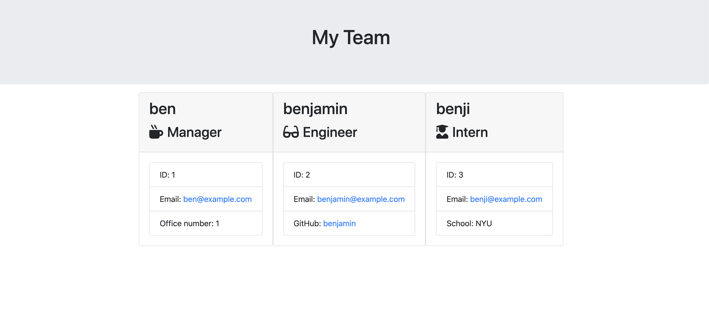

# Template-Engine-Employee-Summary
The Template Engine Employee Summaryn is a Node JS command line app that builds a company team consisting of managers, engineers, and interns. The team is then displayed to a web page where you can see your team and the corresponding information.

REPO link: https://github.com/bendrakeacker/Template-Engine-Employee-Summary

Deployed Link: https://bendrakeacker.github.io/Template-Engine-Employee-Summary/